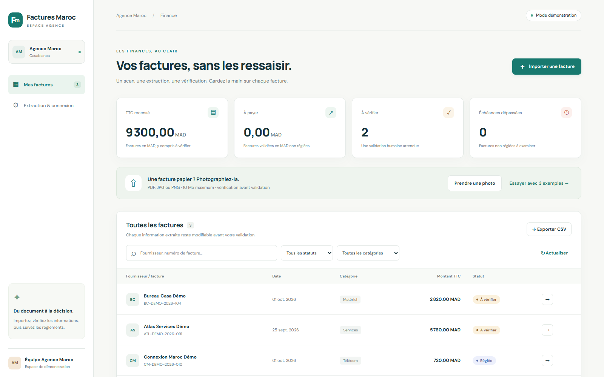
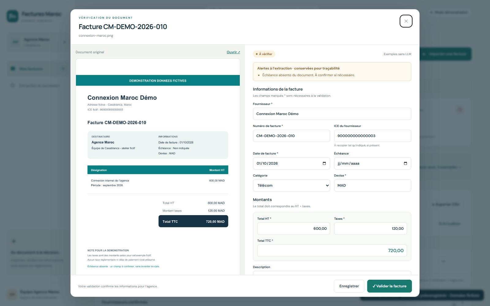

# Factures Maroc

Une application web en français pour centraliser les factures de l'agence Maroc : importer un PDF ou une photo, extraire les champs, corriger et valider la proposition, puis suivre les montants à payer et le paiement renseigné. Le LLM propose les données ; la personne responsable les confirme.

## Démarrer dans Ubuntu WSL

```bash
git clone https://github.com/Mohamedballouch/factures-maroc-demo.git
cd factures-maroc-demo
bash scripts/start.sh
```

Ouvrir http://localhost:5180. Le mode initial est **démonstration sans clé API** : le bouton des exemples importe trois factures fictives et leurs extractions préenregistrées. Il ne fait aucun appel LLM. Un document quelconque demande de configurer un fournisseur réel.

## Parcours de démonstration

1. Charger les exemples fictifs ou importer un fichier connu du dossier `examples/`.
2. Ouvrir une facture et comparer ses champs au document original.
3. Corriger une valeur et enregistrer le brouillon.
4. Valider : le backend vérifie les champs requis et HT + taxe = TTC, puis alimente la fiche fournisseur.
5. Renseigner un paiement et retrouver les factures par fournisseur, catégorie ou statut.
6. Exporter un CSV ; les totaux du tableau de bord sont en MAD, sans additionner d'autres devises.

Le statut **payé** est un suivi manuel ; il ne déclenche aucune transaction. Les sociétés et documents de ce dépôt sont fictifs.

### Voir la démo

[Vidéo MP4 du parcours réel dans l’interface (64 secondes)](demo/demo-factures-maroc.mp4). La vidéo montre le mode démonstration avec extraction préenregistrée, sans appel LLM.





## Brancher un LLM réel

Copier `.env.example` vers `.env` et choisir le fournisseur dans le backend. Pour Claude, renseigner `INVOICE_PROVIDER=anthropic`, `ANTHROPIC_API_KEY` et `ANTHROPIC_MODEL`. Pour Ollama local, renseigner `INVOICE_PROVIDER=ollama`, `OLLAMA_BASE_URL` et un `OLLAMA_MODEL` compatible avec la vision. Redémarrer le serveur après une modification.

La connexion de Claude Code utilisée pour coder avec PDO est distincte de la clé de l'API du LLM utilisée par cette application. Les clés restent dans le backend, `.env` est ignoré par Git. Voir [la configuration détaillée](docs/configuration.md).

## Ce qui enrichit la base

L'extraction produit un brouillon, sa catégorie proposée, les extraits servant de preuves et ses alertes. La validation crée ou retrouve le fournisseur normalisé, rattache la facture et conserve les corrections et changements de statut. Les champs absents restent vides ; le programme ne recherche pas de données sur les fournisseurs en dehors du document.

## Documents et atelier PDO

- [Scénario de démonstration](docs/demo.md)
- [Architecture et flux de données](docs/architecture.md)
- [Installation et configuration des LLM](docs/configuration.md)
- [Besoin fonctionnel détaillé](docs/issue-mvp.md)
- [Pipeline PDO et consignes](docs/pdo.md)
- [Ticket GitHub : historique des corrections et validations](https://github.com/Mohamedballouch/factures-maroc-demo/issues/1)
- [Résultat du vrai run PDO et PR de l’historique](docs/resultat-pdo.md)

Backend FastAPI, stockage SQLite, interface HTML/CSS/JavaScript servie par le même serveur. PDF, PNG et JPEG jusqu'à 10 Mio, PDF jusqu'à 10 pages. Python 3.12 permet de reproduire la préparation.

## Vérification

```bash
.venv/bin/python -m pytest -q
```

Les tests vérifient les adaptateurs LLM avec un transport simulé sans consommer de clé API. Le mode de démonstration ne constitue pas une preuve d'extraction réelle par un modèle. Les factures locales, uploads et la base SQLite sont ignorés par Git dans `data/`.

Ce prototype s'utilise sur localhost, en mono-utilisateur. Une utilisation d'équipe avec de vraies factures nécessite notamment authentification, gestion des droits et sauvegarde ; le [guide de configuration](docs/configuration.md) précise cette évolution.
