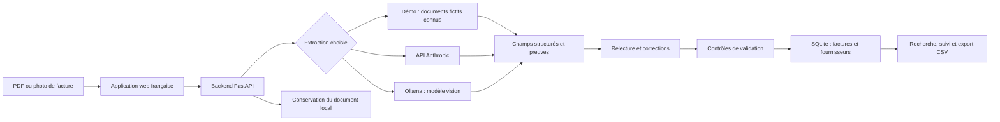
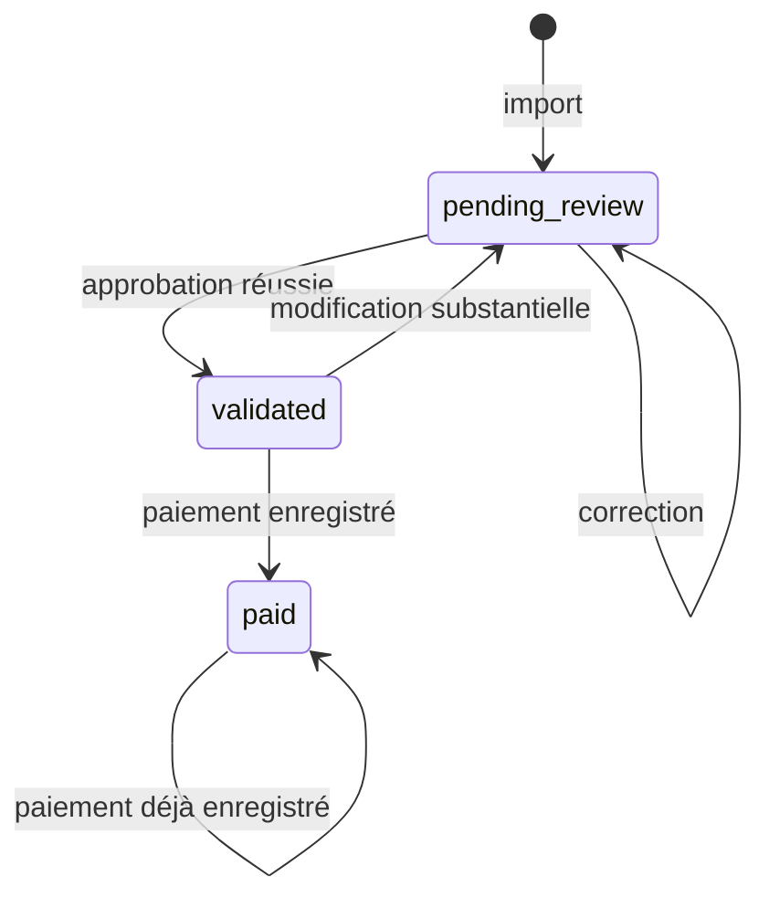

# Architecture du mini-produit Factures Maroc

## Besoin traité

Transformer une facture reçue en PDF ou photographiée en une fiche consultable, avec un document source, une proposition de catégorie et un état de traitement. La personne relit et valide avant que le fournisseur soit ajouté au référentiel. L’application suit les factures de l’agence en MAD et permet un export CSV.

## Vue d’ensemble

Le même serveur sert l’interface dans `web/` et les routes `/api/`. Le navigateur ne contient aucune clé LLM. Les données sont conservées dans le dossier défini par `INVOICE_DATA_DIR`, par défaut `./data`.

## De l’import à la base de données

1. **Recevoir le fichier.** `POST /api/invoices/upload` reçoit un fichier multipart nommé `file`. Le backend vérifie son type réel, la limite de 10 MiB et, pour un PDF, le maximum de 10 pages.
2. **Détecter les doublons.** Le même contenu de fichier ne doit pas produire deux factures. La réponse `409` contient l’identifiant de la facture déjà importée.
3. **Extraire.** Le fournisseur actif renvoie les champs du schéma ci-dessous. Les données absentes restent `null`. Le mode Démo reconnaît uniquement les documents fournis par leur SHA-256.
4. **Structurer.** Le backend valide le format des champs et conserve une facture `pending_review`, ses avertissements, le fournisseur d’extraction et les éléments de preuve. L’original reste consultable.
5. **Relire.** L’utilisateur compare le document et les champs. `PATCH /api/invoices/{id}` enregistre ses corrections et ses notes.
6. **Valider.** `POST /api/invoices/{id}/approve` effectue les contrôles de champs et d’arithmétique. En cas de réussite, la facture devient `validated` et la fiche fournisseur est créée ou actualisée.
7. **Suivre.** `POST /api/invoices/{id}/payment` enregistre le statut `paid`. Le tableau de bord et l’export utilisent les données sauvegardées.

L’enrichissement est ici la structuration de la facture, la suggestion de catégorie et l’alimentation du référentiel fournisseur après approbation. Il n’ajoute pas de données externes sur une entreprise.

## Contrat d’extraction

| Clé | Type | Règle |
|---|---|---|
| `supplier_name` | chaîne ou `null` | Nom lu sur le document |
| `supplier_ice` | chaîne ou `null` | Identifiant lu ; aucune fabrication |
| `invoice_number` | chaîne ou `null` | Numéro de facture lu |
| `invoice_date` | date ISO ou `null` | `AAAA-MM-JJ` |
| `due_date` | date ISO ou `null` | Facultative ; aucune déduction |
| `currency` | chaîne ou `null` | Code de devise explicite, en majuscules |
| `subtotal_ht` | chaîne décimale ou `null` | Exemple `4800.00` |
| `tax_amount` | chaîne décimale ou `null` | Montant lu, aucun taux supposé |
| `total_ttc` | chaîne décimale ou `null` | Montant lu |
| `category` | chaîne ou `null` | Suggestion éditable : Services, Matériel, Télécom, Transport, Autre |
| `description` | chaîne ou `null` | Description résumée de la dépense |
| `warnings` | tableau de chaînes | Points à vérifier |
| `evidence` | objet | Textes justificatifs pour les champs clés |

`evidence` contient exactement les clés `supplier_name`, `invoice_number`, `invoice_date`, `subtotal_ht`, `tax_amount` et `total_ttc`, avec une chaîne ou `null` pour chacune. Il permet d’expliquer une proposition d’extraction ; il ne constitue pas une certification du contenu.

Les montants sont traités avec des décimales pour éviter les écarts d’arithmétique flottante. Le dashboard ne cumule que les montants en MAD ; les autres devises restent sur leurs factures sans conversion implicite.

## États et contrôles

Pour approuver, le fournisseur, le numéro, la date, la devise et les trois montants doivent être renseignés. Les montants doivent être positifs ou nuls et **HT + taxes = TTC**, avec une tolérance de `0.01`. Si l’échéance existe, elle doit être au moins égale à la date de facture. Aucune échéance ni aucun taux de taxe ne sont inventés. Une échéance absente n’empêche pas, à elle seule, la validation.

Une correction substantielle d’une facture validée la remet à relire. Une facture payée est verrouillée pour ce parcours simple. Enregistrer un paiement ne contacte aucune banque.

## Routes utiles

| Route | Rôle |
|---|---|
| `GET /api/health` | Santé du serveur |
| `GET /api/config` | Configuration publique sans secrets |
| `GET /api/invoices` | Liste, filtres, résumé global et fournisseurs |
| `GET /api/invoices/{id}` | Fiche détaillée |
| `POST /api/invoices/upload` | Import et extraction |
| `POST /api/demo` | Chargement idempotent des trois exemples |
| `PATCH /api/invoices/{id}` | Corrections et notes |
| `POST /api/invoices/{id}/approve` | Validation et enrichissement fournisseur |
| `POST /api/invoices/{id}/payment` | Suivi du statut payé |
| `GET /api/invoices/{id}/document` | Original du fichier |
| `GET /api/export.csv` | Export UTF-8 BOM, séparateur `;` |

Le résumé de liste est calculé sur toutes les factures ; `search`, `status` et `category` filtrent les lignes affichées. Le **TTC recensé** inclut les factures à relire en MAD. Le montant **à payer** et les **échéances dépassées** concernent uniquement les factures validées non réglées ; une facture à relire n’est pas encore une dette validée dans ce suivi. L’export neutralise les cellules pouvant être interprétées comme des formules par un tableur.

## Où interviennent PDSF et PDO ?

**Pendant la construction du produit :** lorsqu’il est installé dans le projet, PDSF apporte la méthode, les compétences et les conventions de développement. PDO peut orchestrer le pipeline choisi sur le dépôt approuvé : analyse de l’issue, implémentation, tests et revue. Une personne inspecte les résultats et décide de la suite.

**Pendant l’utilisation du produit :** FastAPI, le fournisseur d’extraction et SQLite assurent le traitement. Un import n’est pas une exécution PDO et ne nécessite pas Claude Code. Le modèle appelé par l’application est configuré côté serveur, indépendamment de l’agent qui a construit le projet.

## Extensions possibles après le MVP

Des rôles utilisateurs, un historique d’audit détaillé, une gestion des avoirs, une intégration comptable et une politique de conservation demanderaient un cadrage distinct. Les prélèvements, règles fiscales, taux et délais réglementaires ne sont pas définis par ce prototype pédagogique.
