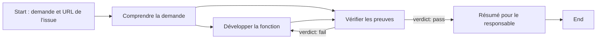

# Rejouer une demande avec PDO

Factures Maroc fonctionne avec son propre backend. Le pipeline PDO **`factures-maroc`** sert à faire évoluer son code depuis une demande précise : comprendre l’issue, développer, vérifier et résumer le résultat pour le responsable.

Le [dépôt public](https://github.com/Mohamedballouch/factures-maroc-demo) contient le produit de départ et le pipeline. L’[issue GitHub #1](https://github.com/Mohamedballouch/factures-maroc-demo/issues/1) demande d’afficher l’historique des corrections, validations et paiements renseignés dans la fiche facture. Elle s’appuie sur les événements déjà conservés en SQLite. Une [copie locale du besoin](issue-history.md) est disponible pour la présentation.

## 1. Préparer le bon clone dans Ubuntu

Utiliser **le même utilisateur Ubuntu que celui qui lance le daemon PDO**. Dans notre démonstration, le clone source est `/home/mohamed_ballouch/factures-maroc-demo`, sur la branche **`develop`**. Le chemin `~/factures-maroc-demo` se résout selon l’utilisateur Ubuntu connecté.

Pour récupérer le dépôt s’il n’existe pas encore :

```bash
cd ~
git clone https://github.com/Mohamedballouch/factures-maroc-demo.git
cd ~/factures-maroc-demo
git switch develop
```

Avec un clone déjà présent, se placer dans ce dossier et contrôler l’état avant de changer de branche. Conserver les modifications locales éventuelles.

```bash
cd ~/factures-maroc-demo
git status --short
git branch --show-current
git remote get-url origin
```

Le remote attendu est `https://github.com/Mohamedballouch/factures-maroc-demo.git`. Si le clone est propre et qu’il faut récupérer `develop` :

```bash
git fetch origin
git switch develop
```

Vérifier également les outils utilisés dans cette démonstration :

```bash
pdo --version
claude --version
gh auth status
gh issue view https://github.com/Mohamedballouch/factures-maroc-demo/issues/1
git config --get user.name
git config --get user.email
```

Les commandes PDO ci-dessous correspondent à **PDO 1.110.0**. Claude Code doit être installé et authentifié dans ce même Ubuntu. `gh` est le moyen prévu par le premier nœud pour lire le ticket. Si son accès n’est pas disponible, le nœud peut consulter la copie locale ; cette lecture de secours doit être signalée dans sa sortie.

Les deux dernières commandes doivent afficher l’identité Git utilisée pour les commits. Si elle manque, la configurer avec ses propres valeurs avant le run :

```bash
git config --global user.name "Prénom Nom"
git config --global user.email "votre-adresse@example.com"
```

`--global` concerne les dépôts de cet utilisateur Ubuntu. L’omettre configure seulement le dépôt courant, si c’est le choix souhaité.

### Environnement Python partagé : facultatif

Les prompts préparés recherchent `/home/mohamed_ballouch/.venvs/factures-maroc-demo/bin/python`. Ce chemin existe sur la machine de démonstration. Sur un autre poste, adapter les prompts à son utilisateur ou laisser l’agent créer une `.venv` ignorée dans le worktree du run.

Pour préparer un environnement partagé dans son propre Ubuntu :

```bash
cd ~/factures-maroc-demo
python3 -m venv ~/.venvs/factures-maroc-demo
~/.venvs/factures-maroc-demo/bin/python -m pip install -r requirements.txt
~/.venvs/factures-maroc-demo/bin/python -m pytest -q
```

Une `.venv` locale du clone n’est pas automatiquement présente dans tous les worktrees PDO. Le dossier partagé évite de réinstaller les dépendances à chaque passage ; il n’est pas nécessaire à la compréhension du pipeline.

## 2. Installer le pipeline dans la bibliothèque PDO

Depuis le clone source sur `develop` :

```bash
cd ~/factures-maroc-demo
mkdir -p ~/.pdo/pipelines
cp pdo/factures-maroc.yaml ~/.pdo/pipelines/
cp -R pdo/factures-maroc.prompts ~/.pdo/pipelines/
```

Le YAML définit les nœuds et leurs connexions ; le dossier `.prompts` contient les consignes de chaque agent. Les conserver ensemble. La bibliothèque `~/.pdo/pipelines` appartient à l’instance PDO de cet utilisateur ; le dépôt choisi pour le run reste un choix distinct.

Si aucun daemon ne tourne encore, le lancer dans un terminal Ubuntu et conserver ce terminal ouvert :

```bash
pdo daemon
```

Si le daemon fonctionne déjà sur **http://localhost:5172**, garder cette instance. Ouvrir l’interface, approuver le chemin du clone dans la configuration des dépôts, puis vérifier que **Pipelines** propose `factures-maroc`. L’URL GitHub du ticket ne remplace pas l’approbation du dépôt local.

## 3. Comprendre les quatre nœuds agents



| Nœud | Ce qu’il reçoit | Ce qu’il doit produire |
|---|---|---|
| **Comprendre la demande** (`issue_reader`) | La demande et l’URL du ticket | Le besoin lu, les critères exacts et un petit plan d’implémentation |
| **Développer la fonction** (`implementer`) | Le cadrage ou les corrections demandées par la revue | Les fichiers modifiés et les vérifications réellement exécutées |
| **Vérifier les preuves** (`reviewer`) | Le cadrage initial et les changements | Une revue indépendante, des preuves et un verdict `pass` ou `fail` |
| **Résumé pour le responsable** (`manager_brief`) | La revue passée | Un brief français : changement visible, intérêt, gestes de démo et limites |

La boucle **`repair-loop`** contient le développement et la vérification, avec **`max_iter: 3`**. Le verdict `fail` revient au développement ; `pass` permet d’avancer vers le brief. La limite correspond à trois passages maximum dans cette région, pas à trois corrections supplémentaires garanties après une première tentative. Si la revue reste en échec, inspecter la cause et le statut du run ; aucun succès ne doit être déduit du simple démarrage du pipeline.

Les quatre nœuds ont `isolated_worktree: false` : ils partagent le worktree de leur run pour travailler sur le même résultat. Le run dispose de sa propre copie de travail par rapport au clone source choisi. Les prompts de cette démonstration ne poussent pas le code, n’ouvrent pas de PR et ne modifient pas l’issue GitHub.

## 4. Créer un run depuis l’interface ou le terminal

Dans **Runs → New Run**, renseigner :

- **Dépôt cible :** `/home/mohamed_ballouch/factures-maroc-demo` sur cette machine ; adapter au chemin réel sur un autre poste.
- **Branche source :** `develop`.
- **Pipeline :** `factures-maroc`.
- **Agent :** Claude Code authentifié dans Ubuntu.
- **Nom :** `Factures Maroc - issue #1 - historique`.
- **Prompt :** la demande de l’issue #1 avec son URL, puis l’exigence de vérifier les critères et de fournir un brief français.

Cliquer sur le lancement et relever l’identifiant généré. La commande suivante est l’équivalent pour PDO 1.110.0 ; l’utiliser **à la place du lancement dans l’interface** pour créer un seul run :

```bash
pdo run create factures-maroc \
  --target-repo "$HOME/factures-maroc-demo" \
  --source-branch develop \
  --harness claude \
  --name "Factures Maroc - issue #1 - historique" \
  --input "Implémenter https://github.com/Mohamedballouch/factures-maroc-demo/issues/1 : rendre visibles les corrections et validations d’une facture. Lire les critères et le contexte du dépôt, développer dans le worktree du run, exécuter les tests puis produire un brief français pour le responsable. Ne pas pousser, ouvrir de PR ni modifier l’issue."
```

Le terminal affiche le résultat de création et l’identifiant du nouveau run. Pour un prompt long, PDO accepte aussi `--input-file /chemin/vers/demande.txt` à la place de `--input`.

**Run exécuté le 1er octobre 2026 :** [`20261001-195856-0e7574a`](http://localhost:5172/runs/20261001-195856-0e7574a/review), état **completed**. Les quatre agents ont terminé au premier passage, le reviewer a rendu `verdict: pass` et les **25 tests ont réussi**. Le développement se trouve dans la [PR #2, en brouillon](https://github.com/Mohamedballouch/factures-maroc-demo/pull/2), commit `9e75c4a`. La PR attend une revue humaine et n’est pas fusionnée. Les liens `localhost` fonctionnent sur le poste du présentateur ; la PR et le [résultat documenté](resultat-pdo.md) se partagent avec l’équipe.

## 5. Inspecter chaque étape

Ouvrir le run dans PDO. Vérifier d’abord **Info** et **Repositories** : identifiant, état, dépôt cible, branche source et copie de travail doivent correspondre à cette demande. Puis sélectionner chaque nœud.

| Surface | Ce qu’il faut contrôler |
|---|---|
| **Inputs / Entrées** | La demande reçue et les résultats transmis par le nœud précédent. Le reviewer doit recevoir les critères et les changements. |
| **Outputs / Sorties** | Le cadrage, les changements, les preuves de revue et le brief. Lire le contenu, pas seulement la couleur du nœud. |
| **Terminal** | Les échanges avec l’agent, les commandes et leurs résultats. Vérifier qu’un test annoncé a réellement été exécuté et voir les erreurs éventuelles. |
| **Diff** | Les fichiers modifiés et le détail des changements. Comparer le résultat aux critères de l’issue. |
| **YAML / Pipeline** | Les consignes et les conditions `verdict: pass` / `verdict: fail`, ainsi que la borne de trois passages. |

Pour l’issue #1, vérifier notamment l’affichage des anciennes et nouvelles valeurs, la séparation des historiques entre factures, leur persistance et le comportement d’un identifiant inconnu. Le terminal du reviewer doit donner les résultats effectivement obtenus. Une vérification dans le navigateur doit être présentée comme exécutée seulement si elle l’a réellement été.

Si un nœud attend une réponse, consulter la bannière et son terminal. Répondre dans la session correspondante selon la demande affichée. Ne pas créer un second run pour contourner une attente dont la cause n’a pas été comprise.

Avant publication, examiner le diff et la fonction dans l’application. Le brief final aide le responsable à comprendre le résultat ; il ne remplace ni les preuves de vérification ni la revue humaine. La publication d’une PR et sa fusion restent des étapes séparées.

## 6. Ticket, PDSF et modèle : trois configurations distinctes

**Ticket GitHub.** Le chemin du clone et son remote déterminent le dépôt de code. L’URL de l’issue fournit le besoin au nœud de lecture, qui utilise `gh` ou la copie locale. Coller un lien ne crée ni webhook, ni synchronisation GitHub, ni récupération permanente de tous les tickets. Ce pipeline ne ferme pas automatiquement l’issue. Un ticket Jira demanderait un moyen de lecture adapté et des consignes propres à ce système.

**PDSF.** PDSF peut installer des compétences et aider à cadrer le projet. PDO exécute le pipeline. Dans ce prototype, `AGENTS.md` et `CONTEXT.md` ont été rédigés pour la démonstration : leur présence n’est **pas la preuve d’une exécution de `/build-factory`**, ni d’une installation complète de PDSF. La lecture de ces fichiers par les agents ne transforme pas ce travail en exécution d’un skill PDSF. PDO peut utiliser ce pipeline sans cette installation.

**Claude Code et le LLM de l’application.** Le harness `claude` lance Claude Code pour développer et vérifier le code. L’extraction d’une facture par l’application utilise, elle, `INVOICE_PROVIDER` et les paramètres API du backend. Une connexion Claude Code ne fournit pas automatiquement `ANTHROPIC_API_KEY` à l’application. Le mode `demo` ne fait aucun appel LLM ; la revue de cette issue d’historique ne nécessite aucune facture réelle ni aucun appel API. Voir le [guide de configuration](configuration.md).
