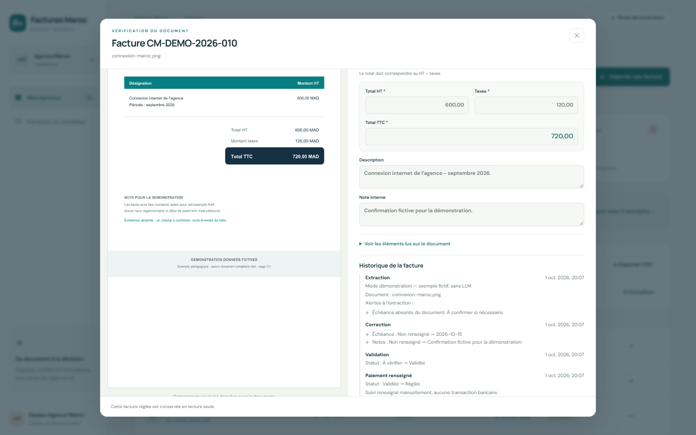

# Résultat du run PDO : historique des factures

Le pipeline `factures-maroc` a implémenté l’[issue #1](https://github.com/Mohamedballouch/factures-maroc-demo/issues/1) dans le run **`20261001-195856-0e7574a`**, terminé le 1er octobre 2026. Le résultat est publié dans la [PR #2 en brouillon](https://github.com/Mohamedballouch/factures-maroc-demo/pull/2), commit `9e75c4a`, contre `develop`. Cette évolution attend une revue humaine. Les branches `main` et `develop` conservent le produit de départ pour pouvoir rejouer l’atelier.

## Ce que chaque agent a fait

| Agent | Résultat réel |
|---|---|
| Comprendre la demande | Lecture de l’issue et du code existant, critères d’acceptation et plan transmis au développement et à la revue |
| Développer la fonction | API `/api/invoices/{id}/history`, affichage français dans la fiche et deux tests supplémentaires couvrant plusieurs comportements |
| Vérifier les preuves | 25 tests réussis, contrôles API, parcours Chromium sur ordinateur et mobile, verdict `pass` |
| Résumé pour le responsable | Brief français sur le changement visible, les gestes de démonstration et les limites |

La boucle n’a pas demandé de correction : chaque agent a terminé à l’itération 1. Le pipeline n’a pas créé la PR lui-même ; elle a été ouverte après la revue et une vérification supplémentaire du résultat. Les sorties et terminaux restent consultables dans PDO sur le poste du présentateur.

## Ce que l’on peut montrer au responsable

La fiche révèle **ce qui a été corrigé** depuis l’extraction. Elle conserve la valeur avant et après, ainsi que le moment de la validation et du paiement renseigné. Une facture affiche uniquement ses propres événements, même après un redémarrage. Le prototype ne possède pas de comptes utilisateurs et n’indique donc pas qui a effectué chaque action.

Pour voir l’évolution sans remplacer la version de départ, récupérer la branche de démonstration dans un autre worktree :

```bash
cd ~/factures-maroc-demo
git fetch origin
git worktree add ../factures-maroc-historique origin/demo/historique-factures
cd ../factures-maroc-historique
INVOICE_PORT=5181 bash scripts/start.sh
```

Ouvrir **http://localhost:5181**. Cette commande crée un environnement local et utilise les exemples préenregistrés, sans clé API.

1. Cliquer sur **Essayer avec 3 exemples**, puis ouvrir Connexion Maroc Démo.
2. Descendre jusqu’à **Historique de la facture** : une extraction apparaît avec sa mention de démonstration.
3. Modifier une note et enregistrer : la correction montre les valeurs avant et après.
4. Valider, puis cliquer sur **Marquer comme réglée** : les deux changements de statut s’ajoutent. Le paiement est un suivi manuel, sans virement.
5. Fermer et rouvrir la fiche, puis ouvrir Bureau Casa : les historiques restent séparés.



## Vérifications réalisées

Les 25 tests vérifient notamment l’ordre stable des événements, les valeurs exactes avant/après, la séparation des factures, la persistance, les réponses 404, la consultation sans modification et le filtrage des champs du payload. Le reviewer a également vérifié le rendu de texte piégé, le bouton de reprise après erreur et l’affichage mobile dans Chromium. Un second contrôle du parcours dans le navigateur a confirmé la correction, la validation, le statut réglé, la séparation et la conservation après rechargement, sur ordinateur et mobile.

Les adaptateurs Anthropic et Ollama restent testés avec des réponses simulées. Aucun document réel ni appel LLM réel n’a été utilisé. La [vidéo MP4](../demo/demo-factures-maroc.mp4) montre le produit de départ ; les captures de cette page montrent l’évolution de la PR.
